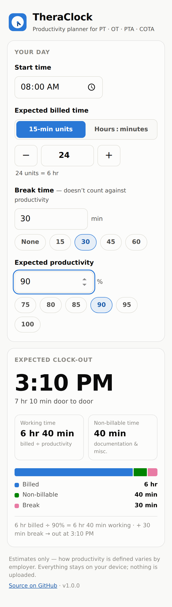
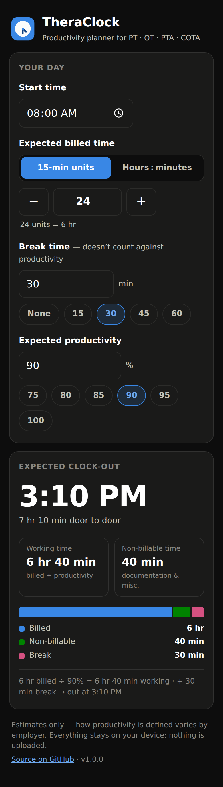

# TheraClock ⏱️

**Know when your day ends.** A productivity planner for physical therapists, occupational therapists, PTAs, and COTAs.

**▶ Use it now: [schmittmeister1.github.io/theraclock](https://schmittmeister1.github.io/theraclock/)**

Enter your start time, expected billed time, break time, and your clinic's expected productivity percentage — TheraClock tells you when you should be able to clock out, plus how much non-billable time you have to work with for documentation and everything else.

| Light | Dark |
|---|---|
|  |  |

## Install it on your phone

TheraClock is a progressive web app: it installs from the browser on both iPhone and Android, works offline once installed, and never sends your data anywhere.

**iPhone / iPad (Safari):** open the link above → tap the **Share** button → **Add to Home Screen** → **Add**.

**Android (Chrome):** open the link above → tap the **⋮** menu → **Add to Home screen** (or the **Install app** prompt) → **Install**.

It then launches full-screen from its own icon, just like a native app.

## The math

Productivity is billed time as a share of working time, and breaks don't count against you:

```
working time = expected billed time ÷ (expected productivity % ÷ 100)
clock-out    = start time + working time + break time
```

**Example:** start at 8:00 AM, expecting 24 units (6 hr) billed at 90% productivity with a 30-minute lunch:

```
6 hr ÷ 0.90 = 6 hr 40 min working time
8:00 AM + 6 hr 40 min + 30 min = 3:10 PM clock-out
```

That also means 40 minutes of non-billable time is built into the day for point-of-service documentation, transitions, and the rest.

Billed time can be entered as **15-minute units** or as **hours : minutes** — the toggle converts between them. Targets above 100% (concurrent/group treatment settings) are supported, with a heads-up warning.

> **Disclaimer:** employers define and measure productivity differently (units vs. minutes, rounding rules, what counts as billable). TheraClock is an estimate to help you plan your day, not a payroll tool.

## Features

- Works offline after first load (service worker precache) — hospital dead zones welcome
- Remembers your last inputs on your device (`localStorage`) — nothing is uploaded, no account, no tracking
- Quick-pick chips for common breaks and productivity targets, a unit stepper, and live recalculation on every change
- Handles edge cases: over-100% productivity, overnight shifts (+1 day flag), and input validation
- Accessible: labeled controls, visible focus rings, color-blind-safe chart palette with a text legend, automatic light/dark mode

## Run it locally

No build step, no dependencies — it's vanilla HTML/CSS/JS:

```bash
git clone https://github.com/schmittmeister1/theraclock.git
cd theraclock
python3 -m http.server 8123
# open http://localhost:8123
```

## Tests

```bash
node test/calc.test.js        # unit tests for the calculation core
node tools/browser_test.mjs   # Playwright end-to-end tests (needs the local server running)
```

## Project structure

```
index.html            the app (single page)
styles.css            styling, light + dark themes
app.js                calculation core + UI wiring
sw.js                 service worker (offline support)
manifest.webmanifest  PWA install metadata
icons/                app icons (generated by tools/make_icons.py)
test/                 unit tests
tools/                icon generator + browser test
```

## License

[MIT](LICENSE)
